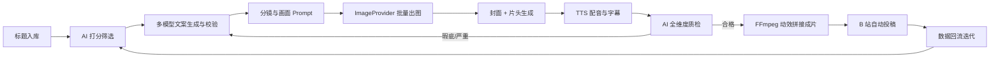

# B 站 AI 全自动科普视频量产系统

> **目标**：面向 B 站创作激励赛道，以代码驱动全链路生产，质量优先、极少人工干预，稳定产出标准化科普视频并获取平台激励。  
> **核心原则**：质量优先 · 全自动执行 · 关键链路用好模型、非关键走低价 API · 异常自动重试  
> **分发**：成片以 **9:16 MP4** 为统一产物；**B 站**为首发与激励回流主站；其他平台见 [§4.8](#48-多平台分发)。  
> **项目形态**：仓库名 **`video_factory`**（monorepo）；不在 MyTodo 项目中开发或部署。本文档与 `选题.md` 为需求规格，位于仓库 `docs/`。  
> **首次实施**：样片验证与 CLI 试运行见 [§11](#11-mvp-试运行)。

---

## 目录

1. [项目范围](#1-项目范围)
2. [核心需求](#2-核心需求)
3. [全自动工作流](#3-全自动工作流)
4. [各环节生产规则](#4-各环节生产规则)
5. [AI 自动化质检体系](#5-ai-自动化质检体系)
6. [技术选型](#6-技术选型)
7. [管理后台](#7-管理后台)
8. [成本与配额](#8-成本与配额)
9. [数据迭代](#9-数据迭代)
10. [人工干预边界](#10-人工干预边界)
11. [MVP 试运行](#11-mvp-试运行)
12. [成功标准与约束](#12-成功标准与约束)
13. [外部 API 注册清单](#13-外部-api-注册清单)

附录：[成本.md](./成本.md) · [平台激励.md](./平台激励.md)

---

## 1. 项目范围

| 维度 | 说明 |
| --- | --- |
| **做什么** | 标题→文案→画面→配音→剪辑→投稿，全自动 |
| **不做什么** | 低质静态素材；日常手动剪辑、改稿、投稿 |
| **人工角色** | 仅抽检成品，不参与制作与修改 |
| **内容边界** | 科普向；禁伪科学、医疗、理财、时政等 |
| **工程边界** | 独立后端 + 管理前端 + Worker；与 MyTodo **零代码依赖** |
| **分发边界** | 生产一次、成片多投；**B 站**为激励与 §9 回流主站；其他平台见 [§4.8](#48-多平台分发) |

---

## 2. 核心需求

- **画面底座（默认）**：**AI 静图 + FFmpeg 动效**（Ken Burns 推拉、转场、叠字幕）；摒弃低质剪映素材库，保障科普图解观感与成本可控。
- **画面升级（可选）**：`KLING_UPGRADE_ENABLED=false`（默认）；开启后指定 segment 可走 **可灵 std** 动态视频（见 [§4.3](#43-画面生产)、[§6.7](#67-provider-抽象)）。
- **品牌包装**：全自动产出 **投稿封面** 与 **片头**；预留 **讲解人卡通 IP** 接入位（形象独立设计，细则见 [§4.7](#47-讲解人-ip待详设)）。
- **全链路无人值守**：从标题入库到 B 站投稿，默认零人工操作。
- **多模型协同**：文案创作、润色、事实校验、标题打分分工明确。
- **全维度 AI 质检**：覆盖文案、画面、音频；不合格自动分级回退重制。
- **合规兜底**：全环节拦截违规、擦边、敏感与事实错误内容。
- **管理后台**：标题、任务、成片、配置、成本与抽检统一可视与操作（见 [§7](#7-管理后台)）。

---

## 3. 全自动工作流



> 可选升级：配置开启且 segment 标记 `visual_mode=kling_std` 时，在 `image` 之后插入 **VideoProvider（可灵）** 出动态片段，跳过该段 FFmpeg 静图动效（见 §6.7）。

### 阶段说明

| 阶段 | 产出物 |
| --- | --- |
| 标题筛选 | 进入生产队列的优质标题 |
| 文案生产 | 分镜脚本 + 口播稿（含字数与时长约束） |
| 画面生产 | 6–8 张 9:16 分镜插画（默认）；可选可灵 std 动态片段 |
| 品牌包装 | 投稿封面图、3～5s 片头 MP4 |
| 音视频 | 配音轨、时间轴字幕、正文+片头合成 MP4 |
| 投稿 | 已发布稿件、封面及元数据 |
| 回流 | 播放/完播/评论/收益等指标 |

### 各环节 AI 一览（按流水线顺序）

| 步骤 | 环节 | 子任务 | AI / 模型 | 部署 | 计费 |
| --- | --- | --- | --- | --- | --- |
| 1 | 标题入库 | 去重、格式化 | 无（规则引擎） | 本地 | 免费 |
| 2 | 标题筛选 | 合规 / 适配 / 爆款 / 热度 | V4-Flash Non-thinking ×2 | API | 低 |
| 3 | 文案生产 | 科普初稿 | **DeepSeek-V4-Flash**（Non-thinking） | API | 低 |
| 3 | 文案生产 | 事实校验 | **DeepSeek-V4-Flash**（Thinking）+ RAG 知识库 | API | 低 |
| 3 | 文案生产 | 口语润色 | **DeepSeek-V4-Flash**（Non-thinking） | API | 低 |
| 3 | 文案生产 | 分镜拆分 | **DeepSeek-V4-Flash**（Non-thinking） | API | 低 |
| 4 | 画面 Prompt | 6～8 段插画 Prompt | V4-Flash Non-thinking | API | 低 |
| 5 | 分镜出图 | 9:16 插画 ×6～8 | **ImageProvider**（默认 Z-Image 文生图） | API | **低** |
| 5b | 动态升级（可选） | 指定段 9:16 视频 | **VideoProvider**（可灵 `kling_std`，默认关） | API | 中 |
| 6 | 封面片头 | 封面图 + 片头短视频 | ImageProvider + FFmpeg 模板 | API/自建 | 低 |
| 7 | 配音字幕 | 口播 + 句级时间轴 | **CosyVoice**（API，同步返回 SRT） | API | 中低 |
| 8 | 文本质检 | 合规 / 事实 / 可读 | **DeepSeek-V4-Flash**（Thinking 终审） | API | 低 |
| 8 | 画面质检 | 文案-画面对齐 | **Qwen2.5-VL-7B-Instruct**（百炼 / 兼容 API） | API | 低 |
| 8 | 画面质检 | 清晰度 / 水印 / 畸形 | YOLOv8n + OpenCV（轻量服务） | 自建 | 可忽略 |
| 8 | 音频质检 | 爆音 / 静音 / 时长 | Silero VAD + 响度规则 | 自建 | 可忽略 |
| 9 | 成片剪辑 | 静图动效、烧字幕、接片头 | FFmpeg（非 AI） | 自建 | 可忽略 |
| 10 | 投稿 | 上传视频+封面、元数据 | B 站开放接口（非 AI） | — | 免费 |
| 11 | 数据回流 | 策略归因 | 统计脚本 + **V4-Flash** 周报（可选） | API | 低 |

> **分工**：文案与质检主模型 **DeepSeek-V4-Flash**；画面对齐 **Qwen-VL**；默认画面成本在 **Z-Image 文生图**（关 `prompt_extend`≈0.1 元/张）；**可灵 std** 仅升级开关开启时产生费用；不按电费/存储计成本。

---

## 4. 各环节生产规则

### 4.1 标题筛选

- 多模型交叉打分，维度：**合规性**、**科普适配度**、**爆款潜力**、**搜索热度**。
- 低于阈值的标题直接淘汰，不进入生产队列（阈值由配置项管理，支持回流数据调参）。

### 4.2 文案生产

| 项 | 标准 |
| --- | --- |
| 字数 | **250–550 字**（默认 ~404 字，5 字/秒；由 `TARGET_FINAL_DURATION_SEC` 推导） |
| 时长 | 1:00–2:00 成片（含片头；正文约 58–118s） |
| 结构 | 单知识点；前 3 秒钩子；结尾 1～2 句收束 + 轻量 CTA |
| 模型分工 | 初稿生成 → 事实校验 → 口语化润色 → 分镜拆分 |
| 硬性规避 | 知识点错误、生硬书面语、不利于 TTS 的断句、多点罗列 |

### 4.3 画面生产

默认路径：静图 + FFmpeg 动效

| 项 | 标准 |
| --- | --- |
| 分镜数量 | 单条 **5–8** 段（`SEGMENT_TARGET_SEC=16` 时约 5～6 镜/90s 正文），与口播段落一一对应 |
| 画幅 | **9:16** 竖屏，单张推荐 **1080×1920** |
| 出图 | **ImageProvider** 批量文生图（默认 Z-Image，见 §6.7） |
| 画风 | 统一科普插画风（卡通实验室 / 信息图解）；Prompt 模板 + 角色风格约束见 §4.7 |
| 动效 | FFmpeg：**Ken Burns**（推拉平移）、交叉淡化、可选轻粒子/高亮框；每段时长跟 TTS 时间轴对齐 |
| 升级 | `KLING_UPGRADE_ENABLED=true` 且 segment.`visual_mode=kling_std` 时，该段改走 **VideoProvider**，参数见下表 |

可选升级：可灵 std（默认关闭）

| 项 | 值 |
| --- | --- |
| 模型 | `kling-v2-5-turbo` + **std** + `duration=5` + 9:16 + `sound=off` |
| 定价 | [金山云价目](https://docs.ksyun.com/documents/44741)：**1.5 元/5s** |
| 触发 | 配置中心或 job 级开关；建议仅对 1～2 个「关键演示」segment 开启 |
| 配额 | Redis `INCR kling:month:YYYYMM`；超 `KLING_MONTHLY_BUDGET_CNY` **告警 + 暂停可灵任务**（静图流水线不受影响） |

### 4.4 音视频生产

- **CosyVoice API** 一次调用输出：配音文件 + 句级字幕时间轴（SRT/JSON），口播稿为唯一文本源。
- 音频质检仅做爆音、静音、时长；不跑 ASR。读稿问题在**文本质检或成片抽检**发现后，**回退改文案 → 重新 TTS**。
- 正文片段由 FFmpeg 自动拼接（静图动效或可选视频段），**前置片头**后烧字幕，**无人工剪辑环节**。

### 4.5 封面制作

| 项 | 标准 |
| --- | --- |
| 用途 | B 站投稿封面（`publish` 阶段随稿件上传）；可供多平台手传 |
| 画幅 | **16:9** 或平台配置项（B 站常见 1146×717 / 16:9 高清封面，以开放接口当期规格为准） |
| 生成 | V4-Flash 生成封面文案与构图 Prompt → **ImageProvider** 出图 → FFmpeg 叠标题字、角标、可选讲解人半身（§4.7） |
| 约束 | 标题可读、无夸大误导、无违规元素；与正文主题一致 |
| 质检 | Qwen-VL 单次：封面与标题/选题是否一致；不合格回退 `cover` stage 重生成 |
| 产物 | `data/media/{job_id}/cover.jpg`（或 PNG） |

### 4.6 片头制作

| 项 | 标准 |
| --- | --- |
| 时长 | 1.5～2.5 秒，竖屏 9:16，与正文分辨率一致 |
| 内容 | 频道/系列名 + 本期标题关键词 + 可选讲解人出场（§4.7） |
| 实现 | **模板化 FFmpeg 合成**（默认）：背景渐变/主视觉静图 + 文字动画 + 讲解人 PNG 入场；不依赖额外视频 API |
| 音频 | 默认无独立 BGM（避免与口播冲突）；可选 0.5s 轻音效（配置项） |
| 拼接 | `ffmpeg` 阶段：`片头.mp4` + `正文.mp4` → `final.mp4` |
| 产物 | `data/media/{job_id}/intro.mp4` |

### 4.7 讲解人 IP（待详设）

> **状态**：形象由项目方**独立设计**，流水线预留接入位；人设、造型、表情库等待下一轮讨论后写入配置与资产目录。

| 维度 | 当前约定（可变更） |
| --- | --- |
| **定位** | 固定卡通讲解人，增强账号辨识度；用于片头、封面、可选画中画（PiP） |
| **资产形态** | 透明底 PNG/SVG 分层；`data/assets/host/` 存放立绘、表情、姿势（待设计交付） |
| **流水线接入** | `HostCompositor`：片头/封面叠图；分镜 Prompt 注入「同一讲解人风格」约束，**不**默认每段都生成真人形 AI 图（降低畸形风险） |
| **默认** | `HOST_ENABLED=false` 时纯文字片头；资产就绪后开 `HOST_ENABLED=true` |
| **待讨论** | 名称、性别/物种、配色、是否与口播「第一人称」绑定、PiP 出现频率、表情与段落情绪映射 |

### 4.8 多平台分发

流水线在 `ffmpeg` 阶段产出 终态成片（9:16、片头+正文、**1:00–2:00**、带字幕），此后分发与生产解耦。`publish` 阶段为**多适配器**：同一 MP4 + 封面依次（或并行）调用各平台 API，失败仅重试该平台，不回到画面生产。

| 平台 | 开放投稿 API（概况） | 典型门槛 | 默认策略 |
| --- | --- | --- | --- |
| **B 站** | 开放平台上传 + 元数据 | 创作者号、应用审核 | **必接**；Worker 自动发；§9 回流主站 |
| **抖音** | 上传 → `create_video` | 开发者应用、OAuth | 可选 `DouyinPublishAdapter` |
| **快手** | 开放平台视频发布 | 应用审核、账号绑定 | 可选 |
| **微信视频号** | 以当期开放能力为准 | 主体资质 | 可选或手传 |
| **小红书** | 部分开放 | 门槛偏高 | 手传或后期再接 |

```text
stage=publish
  ├─ publish_bili      # 必开
  ├─ publish_douyin    # DOUYIN_PUBLISH_ENABLED
  └─ …
```

- **授权**：每平台独立 token，发布前检查过期并刷新。
- **元数据**：标题、话题、封面需**分平台映射**。
- **审核**：发布失败记入 `publish_*` 日志，不判为 quality 失败。
- 各平台激励与优先级见 **[平台激励.md](./平台激励.md)**。

---

## 5. AI 自动化质检体系

> **定位**：文案 Thinking 质检；画面对齐 Qwen-VL API。

### 5.1 文本质检

| 检测项 | 说明 |
| --- | --- |
| 合规 | 违规、擦边、敏感表述 |
| 事实 | 科普知识点正误，杜绝伪科学 |
| 可读性 | 口语化程度、字数区间、语句流畅度 |

### 5.2 画面多模态质检

| 检测项 | 说明 |
| --- | --- |
| 内容对齐 | 插画/视频与文案、Prompt 是否一致，防止跑偏 |
| 画质 | 模糊、黑屏、畸形、色块错乱、水印残留；静图模式不检「动态畸形」 |
| 封面 | 封面与标题、选题一致性（见 §4.5） |
| 合规 | 不适宜或违规画面 |

### 5.3 音频质检

- 爆音、静音、断音（规则检测）。
- 成片总时长是否落在 **1:00–2:00** 标准区间（`FINAL_DURATION_STRICT=true` 时强制 55～130s）。
- 口播内容与断句问题归属**文本质检**；音频轨不合格时回退 **文案 → TTS**，不单独走 ASR。

### 5.4 质检分级与处置

| 级别 | 条件（示例） | 处置 |
| --- | --- | --- |
| **一级 · 合格** | 各维度通过 | 拼接成片 → 投稿队列 |
| **二级 · 瑕疵** | 局部片段异常 | 仅重制异常片段，保留文案与其余画面 |
| **三级 · 严重** | 文案或画面大面积不可用 | 回退至上游阶段（文案或全链路）重制 |

```text
quality stage 产出 QualityReport →
  pass  → ffmpeg → publish
  minor → 标记 bad_segment_ids → 仅重跑 image（及 ffmpeg）
  major → 标记 fail_stage → 从 script 等上游 stage 重调度
```

---

## 6. 技术选型

**项目仓库 `video_factory`**（monorepo），技术栈与 MyTodo 类似但**单独依赖、单独部署**。

### 6.0 仓库结构（规划）

```text
video_factory/                   # 项目根目录（本仓库）
├── backend/
│   ├── main.py                  # Flask 入口（不跑建表）
│   ├── scripts/
│   │   └── db_init.py           # 一次性：python -m scripts.db_init
│   ├── worker/
│   │   ├── __main__.py          # CLI 入口：run / run-once / …
│   │   ├── cli.py               # argparse 启动参数（运维/调试）
│   │   ├── loop.py              # 取 job、按 stage 分发
│   │   ├── context.py           # JobContext：路径、配置快照
│   │   └── stages/              # 每 stage 一个执行器
│   │       ├── title.py … publish.py
│   │       └── quality.py       # 质检 stage（代码名 quality，见 §6.3）
│   └── app/
│       ├── config.py
│       ├── api/                 # REST
│       ├── core/                # 业务规则：job_service、pipeline 等
│       ├── repositories/        # 连接、建表、表读写；SQL 写在 Python 里
│       │   ├── connection.py schema.py job_repo.py …
│       ├── services/            # 外部 API、FFmpeg、Provider、redis/
│       │   ├── llm/ tts/ visual/ media/ publish/ redis/ …
│       └── quality/             # 质检编排（文/画/音/封面）
├── frontend/                  # Vue3 管理后台
├── docs/
├── data/                      # SQLite、成片（.gitignore）
│   └── assets/host/           # 讲解人 IP（§4.7）
├── requirements.txt
```

> **命名约定**：流水线 stage、目录、模块、API 字段等代码标识统一用 **`quality`**（不用 `qc`）；管理后台中文界面仍显示「质检」。

### 6.1 系统组件清单

| 层级 | 组件 | 说明 | 用途 |
| --- | --- | --- | --- |
| **运行时** | Python 3.10+ | 独立 venv/conda | 后端与 Worker |
| **CLI** | argparse | `worker/cli.py` | 运维调试：指定 job、从某 stage 重跑等 |
| **Web 服务** | Flask | `backend/main.py` | 管理后台 API |
| **数据库** | SQLite + **裸 SQL** | `data/data.db`；DDL/DML 均写在 `repositories/*.py` | **不用 ORM**、**不用独立 `.sql` 文件** |
| **数据访问** | `repositories/` | `connection`、`schema`、各表 repo | core/Worker 只调 repo 方法，不散落 SQL |
| **Redis** | 独立实例 | `REDIS_URL` | 队列开关、月度配额计数、job 抢占锁（见 §6.6） |
| **定时** | APScheduler（可选） | `ENABLE_SCHEDULER` 默认 `false` | 日批打分、数据回流 |
| **任务 Worker** | 独立进程 | `python -m worker` | 按 `stage` 执行流水线 |
| **并行** | ThreadPoolExecutor | 标准库 | 出图 3～5 张并行；可灵升级段 2～3 路并行 |
| **媒体处理** | FFmpeg | 部署机安装 | 静图动效、片头、烧字幕、拼接 |
| **视觉规则** | OpenCV + YOLOv8n | pip | 画质检测 |
| **音频规则** | Silero VAD + 响度检测 | pip | 爆音、静音、时长 |
| **LLM** | DeepSeek V4-Flash API | 环境变量密钥 | 文案、打分、质检 |
| **多模态** | Qwen2.5-VL-7B API | 百炼等 | 画面对齐 |
| **分镜出图** | ImageProvider（默认 Z-Image） | `DASHSCOPE_API_KEY` | ~0.1 元/张，见 [成本.md](./成本.md) |
| **动态升级** | VideoProvider（可灵 std，可选） | `KLING_API_KEY` | 默认关闭，见 [成本.md](./成本.md) |
| **品牌合成** | HostCompositor + 片头/封面模板 | `data/assets/host/` | 讲解人待设计 |
| **配音字幕** | CosyVoice API | 硅基流动/阿里 | 音频 + 句级时间轴 |
| **Embedding** | bge-m3 | API 或本地 | RAG 知识库 |
| **投稿** | B 站开放接口 | — | 上传与元数据 |
| **产物存储** | `data/media/` 或 OSS | 配置项 | 片段、音轨、成片 |
| **管理端** | Vue3 + Element Plus | `frontend/` | 标题库、队列、配置、成本 |
| **鉴权** | JWT（自建用户表或单用户 Token） | 新建 | 后台登录 |

### 6.2 任务编排（轻量 Worker）

稳态 **日产 20～25 条**（短片编码更快），采用 **SQLite 任务表 + 单 Worker 状态机**（可水平扩展 Worker），不使用 Celery。

| 表/字段（示意） | 说明 |
| --- | --- |
| `video_job` | 一条成片任务：`stage`、`status`、`fail_stage`、`retry_count` |
| `video_segment` | 分镜段：`segment_id`、`visual_mode`（`static_motion`/`kling_std`）、`image_path`、`clip_path` |
| `stage` 枚举 | title→script→**image**→**cover**→**intro**→tts→**quality**→ffmpeg→**publish**→done |

| 机制 | 实现 |
| --- | --- |
| 投递 | 管理后台 / API 插入 `pending`；CLI 亦可创建并执行（见 `worker/cli.py`） |
| 执行 | `loop` 轮询 `pending`/`running`；CLI `run` 可同步跑单 job |
| 出图并行 | 同 job 内 `ThreadPoolExecutor(max_workers=5)` 批量调 ImageProvider |
| 二级重制 | 指定 `segment_id` 置 `pending`，Worker 只重跑 `image`（及依赖的 `ffmpeg` 片段） |
| 三级回退 | 写 `fail_stage=script`，从该 stage 往后重跑 |
| 队列暂停 | Redis `vf:queue:paused`；API/后台写入，Worker 每轮读取 |
| 配额计数 | 出图 / 可灵段完成后 `INCR` 对应月度 key（§6.6） |
| job 抢占 | 单 Worker 下 Redis `SET NX` 锁或 SQLite 事务 `UPDATE … RETURNING` 二选一；**推荐 Redis 锁** |
| 定时（可选） | `ENABLE_SCHEDULER=true` 时：标题批打分、B 站数据拉取；**默认 false** |

Flask **不执行**长耗时步骤；Worker 单独进程启动，与 API 可同机或分机部署。

### 6.3 后端模块划分

**分层依据**：API 与 Worker 分离；Worker 按 **stage** 切执行器；外部依赖收敛到 **services**；API/Worker 共用 **`core/`** 业务规则（不用 `domain` 命名，避免 DDD 术语歧义）。

| 路径 | 职责 | 划分依据 |
| --- | --- | --- |
| `backend/worker/cli.py` | argparse：`run` / `--job-id` / `--from-stage` 等 | 运维调试；同步跑单 job |
| `backend/worker/loop.py` | 按 `stage` 执行单 job 或轮询 `pending` | 长耗时任务不进 Flask |
| `backend/worker/stages/` | 每 stage 一个 `StageExecutor` | 与 `stage` 枚举一一对应，改环节只改单文件 |
| `backend/app/core/` | `pipeline`、`job_service`、`title_service`、`cost_tracker` | 创建 job、重跑、fail_stage；**只调 repositories**，不写 SQL |
| `backend/app/api/` | `/api/v1/*` REST，校验入参后调 core | 按管理后台资源切路由（titles、jobs、config、stats） |
| `backend/app/repositories/` | `connection.py`、`schema.py`、`job_repo` 等 | 连接 + 建表（Python 内 SQL）+ 业务 CRUD；返回 `dict` / 轻量 data class |
| `backend/app/services/` | DeepSeek、CosyVoice、`visual/`、`media/`、`publish/`、`redis/` | 外部依赖与 Redis 客户端 |
| `backend/app/quality/` | 质检编排：`orchestrator`、`text_quality`、`visual_quality`、`audio_quality` | 横切关注点独立成包；由 `stages/quality.py` 调用 |
| `backend/tests/` | stage、pipeline、Provider 单测 | — |

调用边界（禁止违反）

```text
api/*  → core/* → repositories/*
worker/stages/*  → core/* | services/* | quality/*
worker/stages/*  → repositories/*（经 core 优先，stage 内可读 segment 状态）
services/redis/*  → Redis（配额、锁、暂停开关）
core/*  ↛  repositories/connection 等底层   # 禁止 core 手写 SQL；只调 repo 公开方法
repositories/*_repo  ↛  core/*     # 表 repo 无业务分支；connection/schema 除外
services/*  ↛  worker/*
api/*  ↛  services/visual 等
```

**`worker/stages/` 与 stage 对照**

| stage | 文件 | 主要依赖 |
| --- | --- | --- |
| `script` | `script.py` | `services/llm` |
| `image` | `image.py` | `services/visual`（ImageProvider / 可选 VideoProvider） |
| `cover` | `cover.py` | `services/visual/cover` |
| `intro` | `intro.py` | `services/visual/intro` |
| `tts` | `tts.py` | `services/tts` |
| `quality` | `quality.py` | `app/quality/orchestrator` |
| `ffmpeg` | `ffmpeg.py` | `services/media/ffmpeg` |
| `publish` | `publish.py` | `services/publish` |

**`app/quality/` 输出结构（示意）**

```python
@dataclass
class QualityReport:
    level: Literal["pass", "minor", "major"]
    fail_stage: str | None       # 三级回退目标 stage
    bad_segment_ids: list[int]   # 二级重制
    details: dict                # 写入 job 详情 / quality_report 字段
```

### 6.4 模型模式与路由（LLM / 多模态）

| 场景 | API 模型 ID | 模式 |
| --- | --- | --- |
| 标题打分、润色、分镜、Prompt | `deepseek-v4-flash` | Non-thinking（低延迟低价） |
| 初稿、事实校验、文本质检终审 | `deepseek-v4-flash` | Thinking（质量优先） |
| 单段画面是否跑偏 | `qwen2.5-vl-7b-instruct` 等 | 多模态单帧/多帧 |
| 疑难事实（校验打回） | 可选 `deepseek-v4-pro` | 仅失败重试时触发 |

RAG：embedding 用 **bge-m3**（API 或本地均可，成本极低）；知识库为科普事实片段。

### 6.5 数据层：裸 SQL + Repositories

**选型**：**不用 SQLAlchemy / ORM**；SQLite 标准库 `sqlite3` + 手写 SQL + **Repository 模式**。不设 `db/` 目录、**不设独立 `.sql` 文件**——建表 DDL 与业务 DML **都写在 Python 模块里**（字符串或 `conn.execute(...)`），统一放在 `repositories/`。

```text
app/repositories/
├── connection.py      # get_connection()、PRAGMA WAL、row_factory
├── schema.py          # 建表/迁表脚本（一次性手动执行，见 §6.5）
├── job_repo.py
├── segment_repo.py
├── title_repo.py
├── job_log_repo.py
└── …
```

| 文件 | 职责 |
| --- | --- |
| `connection.py` | 库路径、`get_connection()`；**不**在启动时建表 |
| `schema.py` | 建表/补列逻辑（Python 内 SQL）；**仅一次性手动执行**，非常驻启动流程 |
| `*_repo.py` | 业务 CRUD；参数化查询；`core` **只调这里** |
| `app/core/` | 业务规则；**不出现** SQL 字符串 |

Repository 示例

```python
# repositories/job_repo.py
def claim_next_pending(conn) -> dict | None:
    """Worker 取一条 pending job（可与 Redis 锁配合）"""
    ...

def update_stage(conn, job_id: int, stage: str, status: str) -> None:
    ...
```

表与 repo 对照

| 表 | Repository | 说明 |
| --- | --- | --- |
| `title` | `title_repo` | 选题库、打分、入队状态 |
| `video_job` | `job_repo` | stage、status、fail_stage、script_json、quality_report |
| `video_segment` | `segment_repo` | 分镜段、visual_mode、路径 |
| `job_log` | `job_log_repo` | stage 日志、异常栈 |
| `config_store` | `config_repo` | Prompt 模板、阈值（或用 JSON 文件 + repo 缓存） |
| `publish_record` | `publish_repo` | b vid、多平台发布状态 |

**建表 / 迁表（一次性，非启动）**：表结构变更属于**运维一次性工作**；`main.py` 与 Worker **启动时不执行**建表或迁移。需要时单独跑脚本，例如：

```bash
python -m scripts.db_init          # 或 python -m app.repositories.schema
```

`schema.py` 内集中 DDL（`CREATE TABLE IF NOT EXISTS`、必要时 `ALTER TABLE`）；改表只改此文件，再**手动**重跑上述命令。不维护 `.sql` 文件目录，也不做自动迁移框架。

```python
# repositories/schema.py（示意，供 db_init 调用）
def apply_schema(conn) -> None:
    conn.executescript("""
        CREATE TABLE IF NOT EXISTS video_job (...);
        CREATE TABLE IF NOT EXISTS video_segment (...);
        ...
    """)
    conn.commit()

# scripts/db_init.py（示意）
if __name__ == "__main__":
    with get_connection() as conn:
        apply_schema(conn)
```

**约定**：部署新机 / 本地首次搭环境时跑 **一次** `db_init`；日常启 API + Worker **不再碰** schema。

**产物路径约定**（`VIDEO_DATA_DIR`，默认 `./data/media`）：

| 路径 | 说明 |
| --- | --- |
| `{job_id}/cover.jpg` | 投稿封面 |
| `{job_id}/intro.mp4` | 片头 |
| `{job_id}/segments/{n}.mp4` | 分镜片段 |
| `{job_id}/final.mp4` | 终态成片（9:16，片头+正文+字幕） |

### 6.6 Redis 用途与 Key 约定

Redis 为**辅助层**：不做业务主存储（真相在 SQLite）。用于跨进程共享的**开关、计数、短锁**；Flask 与 Worker 同读 `REDIS_URL`。

```text
app/services/redis/
├── client.py          # 连接单例；decode_responses=True
├── keys.py            # key 前缀与构造
├── queue_control.py   # 全局暂停
├── quota.py           # 月度出图 / 可灵 / DeepSeek 计数
└── lock.py            # job 抢占锁（可选 worker 心跳）
```

**Key 命名**（前缀 `vf:` = video_factory，便于多项目共 Redis）

| Key | 类型 | 写入方 | 说明 |
| --- | --- | --- | --- |
| `vf:queue:paused` | string `0`/`1` | API 后台 | Worker 每轮开头检查；`1` 时不再 claim 新 job |
| `vf:lock:job:{job_id}` | string + TTL | Worker | `SET key worker_id NX EX 3600`；防止异常双 Worker 重复跑（单 Worker 也建议保留） |
| `vf:quota:image:{YYYYMM}` | counter | `image` stage | 每成功出图 `INCR`；对照 `IMAGE_MONTHLY_BUDGET`（可选告警） |
| `vf:quota:kling:{YYYYMM}` | counter | VideoProvider | 仅升级开启时 `INCR`；超 `KLING_MONTHLY_BUDGET_CNY` 置 `vf:kling:paused=1` |
| `vf:kling:paused` | string `0`/`1` | quota 逻辑 | 为 `1` 时 segment 不得走 `kling_std`，降级静图或跳过 |
| `vf:quota:deepseek:{YYYYMM}` | counter / float | `services/llm` | 可选：按估算 Token 累加，超 cap 暂停 Thinking 路径 |

与 SQLite 的分工

| 数据 | 存哪 | 原因 |
| --- | --- | --- |
| job 阶段、文案、路径、质检结果 | SQLite | 需持久、可查询、可关联 |
| 全局暂停、月度用量累计 | Redis | 读写快、API/Worker 共享 |
| 成本仪表盘展示 | SQLite 为主 + Redis 实时计数校准 | 月度报表可定时把 Redis 计数刷入 SQLite `usage_monthly` 表（可选） |

**docker-compose（示意）**：服务 `redis:7-alpine`；`backend` 与 `worker` 均依赖 `redis`，共用 `REDIS_URL=redis://redis:6379/0`。

上线至少需：`vf:queue:paused` + `vf:quota:image:{YYYYMM}` + `vf:lock:job:{id}`；可灵 / DeepSeek 计数可按需启用。

### 6.7 Provider 抽象

画面相关外部能力统一抽象，Worker 只依赖接口，不硬编码供应商。

```text
backend/app/services/visual/
├── visual_mgr.py        # ImageProvider 工厂与批量出图
├── image_zimage.py      # 默认：Z-Image 文生图（百炼）
├── image_wan.py         # 备选：通义万相文生图
├── image_mock.py        # MOCK 占位图
├── video_kling.py       # 可选：可灵 std
├── intro.py             # 片头流水线
└── title_render.py      # 封面/标题叠字
```

| 接口 | 职责 | 默认实现 |
| --- | --- | --- |
| **ImageProvider** | `generate(prompt, size, style_ref) → image_path` | `z_image_t2i`（Z-Image 文生图） |
| **VideoProvider** | `generate(prompt, duration, aspect) → video_path` | `kling_std`（**仅升级开关开启**） |
| **MotionCompositor** | `image_to_clip(image, duration, preset) → clip_path` | 本地 FFmpeg |
| **HostCompositor** | `overlay(host_asset, canvas, layout) → image_path` | 读 `data/assets/host/` |

配置项（环境变量或配置中心）：

| 变量 | 默认 | 说明 |
| --- | --- | --- |
| `IMAGE_PROVIDER` | `z_image_t2i` | 分镜插画 + 封面底图；备选 `wan_t2i` |
| `Z_IMAGE_MODEL` | `z-image-turbo` | 百炼 Z-Image 模型 |
| `Z_IMAGE_SIZE` | `720*1280` | 分镜出图 API 尺寸（FFmpeg 合成至 1080×1920） |
| `Z_IMAGE_PROMPT_EXTEND` | `false` | 关≈0.1 元/张，开≈0.2 元/张 |
| `VIDEO_PROVIDER` | `kling_std` | 仅 `KLING_UPGRADE_ENABLED=true` 时生效 |
| `KLING_UPGRADE_ENABLED` | `false` | 可灵动态升级总开关 |
| `HOST_ENABLED` | `false` | 讲解人叠图（资产就绪后开启） |
| `MOTION_PRESET` | `ken_burns_slow` | 默认动效模板 |

segment 级路由示例：

```text
visual_mode=static_motion  → ImageProvider → MotionCompositor
visual_mode=kling_std      → VideoProvider（需 KLING_UPGRADE_ENABLED）
```

---

## 7. 管理后台

流水线全自动；**配置、监控、抽检、手动重试**由管理后台（`frontend/` + Flask API）完成。

### 7.1 功能模块

| 模块 | 功能 |
| --- | --- |
| **标题库** | 批量导入（对接 `选题.md` 规则）、列表、AI 打分结果、筛选入队 |
| **生产队列** | `video_job` 列表：阶段、状态、耗时、错误信息；筛选 pending/running/failed |
| **任务详情** | 口播稿、分镜、每段插画/动效状态、封面与片头预览、配音、`quality_report`（界面显示「质检报告」）、成片下载 |
| **人工操作** | 暂停/恢复队列；对 job 触发「从某 stage 重跑」；二级指定片段重制 |
| **抽检** | 成片标记通过/打回；打回时选择回退 stage（文案/画面/封面） |
| **配置中心** | Prompt、画风、Image/Video Provider、`KLING_UPGRADE_ENABLED`、`HOST_ENABLED` |
| **成本与数据** | 月出图张数、可灵段数（若有）、Token/字数、单条成本、播放收益（[成本.md](./成本.md)、§9） |
| **日志** | 按 job 查看 stage 日志与外部 API 报错栈 |

### 7.2 接口与页面

| 端 | 路径（规划） |
| --- | --- |
| 前端 | 独立站点，如 `http://localhost:5174`（Vite 默认另端口） |
| 页面 | 标题库 / 生产队列 / 配置 / 数据（多 Tab 单页应用） |
| 后端 API | `http://localhost:8xxx/api/v1/*` |
| Worker | 无 HTTP；经 `repositories/` 读写 SQLite；Redis 读暂停/锁/配额 |

### 7.3 权限

- 自建简单账号或单用户 `ADMIN_TOKEN`（亦可仅 Bearer 校验）。
- 写操作：暂停队列、重跑 stage、改配置、抽检打回。

---

## 8. 成本与配额

成本核算、月度损益、各环节 API 用量与配额管控已独立为 **[成本.md](./成本.md)**，含：

- 画面计费、单条/月度预算、盈亏平衡播放
- 重制成本、质感开关、Redis 配额与环境变量

流水线各环节 AI 一览见 [§3](#各环节-ai-一览按流水线顺序)；管理后台成本仪表盘见 [§7](#7-管理后台)。

---

## 9. 数据迭代

自动抓取已发布稿件的 **播放、完播、评论、收益** 等指标，回流至系统后用于：

- 优化标题打分权重与淘汰阈值；
- 优化文案 Prompt 与口播风格（含前 3 秒钩子、结尾 CTA）；
- 优化画面 Prompt 模板与分镜策略；
- **短科普优先跟踪**：完播率、平均播放时长（代理 3 秒留存）、互动率（赞/评/藏 ÷ 播放）。

目标：**产量稳定的前提下，随数据积累提升通过率、完播与爆款率**。

---

## 10. 人工干预边界

| 允许 | 不允许 |
| --- | --- |
| 后台抽检、打回、暂停队列 | 制作中手动剪辑、补画面 |
| 对 job 触发「从某 stage 重跑」 | **绕过 quality** 的投稿 |
| 下载/导出成片，多平台手传 | 在后台直接改口播稿（应走 `script` stage 重跑） |
| 查看成本与播放数据 | — |

---

## 11. MVP 试运行

> **原则**：**先 1 条样片、后批量**；**无前端**；后端 + Worker CLI 跑通即可；**不开定时**。

| 阶段 | 目标 | 入口 |
| --- | --- | --- |
| **MVP-0** | 跑 **1 条**样片，本地看 `final.mp4` 效果 | Worker CLI（`--skip-publish`） |
| **MVP-1** | 样片满意后 CLI 批量约 **20 条**，看成本与播放 | Worker CLI 循环 / 简单脚本 |
| **通过后** | Flask + Vue 管理后台、可选日批 | 见 §7 |

### 11.1 MVP-0：单条样片（CLI）

**不启动**：`frontend/`、Flask `main.py`、APScheduler。

| 步骤 | 命令 / 动作 |
| --- | --- |
| 0. 建表（一次性） | `python -m scripts.db_init` |
| 1. 配 `.env` | DeepSeek、百炼（Z-Image+Qwen-VL）、CosyVoice；B 站 Key **样片可不配** |
| 2. 跑一条样片 | 见下方 **CLI 参数**；默认 **`--skip-publish`**，只产出本地成片 |
| 3. 看进度 | 查 SQLite `video_job` / `job_log`（§11.2） |
| 4. 看成品 | 打开 `data/media/{job_id}/final.mp4`（及 `cover.jpg`、分镜图） |

Worker CLI 参数（规划）

```bash
cd backend

# 推荐：一条标题从头跑到成片（不投稿）
python -m worker run \
  --title "不锈钢能被磁铁吸住，就代表买到次品了？" \
  --skip-publish

# 已有 job，从当前 stage 继续
python -m worker run --job-id 1

# 从指定 stage 重跑（样片调试用）
python -m worker run --job-id 1 --from-stage image

# 样片通过后，单条带 B 站投稿
python -m worker run --title "..." --publish
```

| 参数 | 说明 |
| --- | --- |
| `--title` | 直接传入标题文案；内部创建 `video_job` 并从 `script` 起执行（或经简易标题校验） |
| `--job-id` | 操作已有任务；与 `--title` 二选一 |
| `--from-stage` | 重跑起点：`script` / `image` / `quality` / `ffmpeg` 等 |
| `--skip-publish` | **MVP-0 默认**：跑到 `ffmpeg` 完成即停，不调用 B 站 API |
| `--publish` | 显式开启 `publish` stage（样片满意后再用） |

实现上：`worker/cli.py` 解析参数 → 调 `core/job_service` 创建或加载 job → `loop.run_job(job_id)` 同步跑完（MVP 单进程、不常驻 daemon）。

验收清单见 [§11.6](#116-mvp-验收标准)。

### 11.2 用数据库看状态

无前端时，**SQLite 为唯一监控面板**（`sqlite3` / TablePlus / DBeaver 均可）。

```bash
sqlite3 data/data.db

# 任务总览
SELECT id, title, stage, status, fail_stage, retry_count, updated_at
FROM video_job ORDER BY id DESC;

# 某 job 分镜段
SELECT segment_index, visual_mode, image_path, clip_path
FROM video_segment WHERE job_id = 1 ORDER BY segment_index;

# 阶段日志
SELECT stage, message, created_at FROM job_log WHERE job_id = 1 ORDER BY id;
```

| 字段 | 含义 |
| --- | --- |
| `stage` | 当前/最后执行的流水线阶段 |
| `status` | `pending` / `running` / `done` / `failed` |
| `fail_stage` | 三级回退目标 |
| `script_json` | 口播稿、分镜（JSON，可导出查看） |
| `quality_report` | 质检结果 JSON |

成片路径固定：`data/media/{job_id}/final.mp4`（见 [§6.5](#65-数据层裸-sql--repositories) 产物路径约定）。

### 11.3 MVP-1：批量 15 条（仍无前端）

样片满意后，仍用 **CLI**，不依赖管理后台：

0. 已执行过 `db_init`  
1. 准备标题列表（JSON/CSV 或 `选题.md` 里挑 15 条）  
2. 脚本循环：`python -m worker run --title "..." --skip-publish` 或先入队再 `python -m worker drain`（消费所有 `pending`）  
3. 批量查库对比 `stage`/`status`；打开各 job 目录看成片  
4. 满意条目标 `--publish` 或单独跑 `publish` stage；播放数据待管理后台就绪后再接 API  

稳态日成本约 **~19 元/日**、月约 **~570 元**（见 [成本.md](./成本.md)）；盈亏对照 [成本.md §5](./成本.md#5-月度损益创作激励)。

### 11.4 与完整系统的关系

| 项 | MVP-0 | MVP-1 | 完整系统 |
| --- | --- | --- | --- |
| 前端 | ❌ | ❌ | Vue 管理后台 |
| Flask API | ❌ | ❌ 可选 | ✅ |
| 任务投递 | CLI `--title` | CLI 批量 | 后台 / API / 定时 |
| 看进度 | **查 SQLite** | 查库 + 看文件夹 | 后台 UI |
| 投稿 | 默认跳过 | 按需 `--publish` | Worker 自动 |
| 定时 | ❌ | ❌ | `ENABLE_SCHEDULER=true` |

全自动仍是终态；**MVP-0 只要求 1 条样片可重复跑出**。

### 11.5 MVP 阶段多平台策略

多平台通用规格见 [§4.8](#48-多平台分发)。MVP 阶段仅做**分发策略裁剪**，不重复实现细节。

| 阶段 | B 站 | 其他平台 |
| --- | --- | --- |
| **MVP-0** | 默认 `--skip-publish`，不调用 API | 不涉及 |
| **MVP-1** | 满意条目按需 `--publish`；播放数据可手查 | **默认关闭**各平台 API；下载 `final.mp4` **手传**验证曝光 |
| **MVP 通过后** | 接入管理后台与定时回流（§7、§9） | 再按需接 1～2 个平台 `PublishAdapter` |

- **手传是 MVP 省事选项**，不是技术上限；验证约 15 条后再接抖音/快手 API 更稳。
- 赚钱与调参仍以 B 站为主；各平台激励见 **[平台激励.md](./平台激励.md)**。

### 11.6 MVP 验收标准

#### MVP-0（单条样片）

- [ ] `python -m scripts.db_init` 后，`python -m worker run --title "…" --skip-publish` 可跑通至 `final.mp4`。
- [ ] 无需启动 Flask / `frontend/`。
- [ ] `video_job` / `job_log` 可查到 stage 推进与错误信息。
- [ ] 样片时长约 **1:00–2:00**，画面为静图动效默认路径。

#### MVP-1（批量约 15 条）

- [ ] CLI 可连续投递约 **15 条** 并统计单条成本（[成本.md](./成本.md)）。
- [ ] 按需 `--publish` 的条目可完成 B 站投稿（可选）。
- [ ] 满意后可启动 Flask + 管理后台，进入 §7 常规运维。

---

## 12. 成功标准与约束

### 12.1 成功标准（验收参考）

- [ ] 单条视频从标题入库到投稿 **无需人工点击**即可完成（除配置与告警处理）。
- [ ] 质检三级逻辑可复现：二级仅重制片段，三级可回退指定阶段。
- [ ] 成片时长稳定在 **1:00–2:00**，字数 **250–550**（默认 ~404 字）。
- [ ] 可灵升级开启且配额触顶时，**仅暂停可灵段**、静图流水线可观测（日志/告警）。
- [ ] 封面、片头可自动生成并随 B 站投稿上传；`HOST_ENABLED=false` 时纯模板片头可跑通。
- [ ] 违规与伪科学样本能被文本质检拦截。
- [ ] 管理后台可完成：标题入队、队列监控、详情预览、按 stage 重跑、抽检打回、播放回流。

### 12.2 风险与约束

- **外部依赖**：百炼 Z-Image / CosyVoice / DeepSeek 可用性；可灵仅为可选升级依赖。
- **API 依赖**：密钥轮换与超时重试必做；ImageProvider 可切换备用实现。
- **产能**：默认路径瓶颈在出图并发与 FFmpeg；无视频 API 排队压力。
- **工程**：`video_factory` 仓库单独运维；与 MyTodo 仅文档级参考，不共享数据库与部署。
- **平台规则**：B 站投稿接口、封面规格、内容规范变更需可配置。
- **版权**：文生图/可灵商用授权以各平台当期条款为准；讲解人 IP 资产权归项目方。

---

## 13. 外部 API 注册清单

实施前需逐项注册并写入 `.env`（勿提交仓库）。下表为**当前方案**所需；供应商二选一处在备注说明。

### 13.1 必注册（上线最小集）

| # | 平台 | 用途 | 环节 | 环境变量 |
| --- | --- | --- | --- | --- |
| 1 | **DeepSeek** | 文案、打分、质检 | 2～4、8、11 | `DEEPSEEK_API_KEY` |
| 2 | **阿里云百炼** | Z-Image 文生图 + Qwen-VL | 5、6、8 | `DASHSCOPE_API_KEY` |
| 3 | **CosyVoice** | 配音+字幕轴 | 7 | `TTS_API_KEY` 等 |
| 4 | **B 站开放平台** | 投稿+封面 | 10 | `BILI_CLIENT_*` |
| 5 | **B 站创作者号** | 发布主体 | 全流程 | `BILI_ACCESS_TOKEN` |

注册入口：

- #1 [DeepSeek](https://platform.deepseek.com)
- #2 [阿里云百炼](https://bailian.console.aliyun.com)（Z-Image 文生图 + Qwen-VL；CosyVoice 可同 Key，见 §13.2）
- #3 CosyVoice：§13.2
- #4 [B 站开放平台](https://open.bilibili.com)
- #5 B 站实名创作者账号

`deepseek-v4-pro` 与 #1 同 Key，无需另注册。

### 13.1.1 可选注册（画面升级）

| # | 平台 | 用途 | 默认 | 环境变量 |
| --- | --- | --- | --- | --- |
| 6 | **可灵 Kling** | VideoProvider std 升级 | **关** | `KLING_API_KEY` |

- 入口：[可灵开发者](https://klingai.com/dev)（国内可用 [金山云星流](https://docs.ksyun.com/documents/44983)）
- 仅 `KLING_UPGRADE_ENABLED=true` 时需要配置 Key

### 13.2 CosyVoice 供应商（二选一）

| 供应商 | 说明 | 注册入口 |
| --- | --- | --- |
| **阿里云百炼** | 与 #4 共用 `DASHSCOPE_API_KEY` 时可只注册百炼一家 | 百炼 → 语音合成 / CosyVoice 模型 |
| **硅基流动** | 独立 Key；模型路由填写 CosyVoice 相关模型 | [siliconflow.cn](https://siliconflow.cn) |

选型时确认接口**返回句级时间戳（SRT/JSON）**，见 §4.4。

### 13.3 建议注册（RAG 事实库）

| # | 平台 | 用途 | 是否必注 | 注册入口 | 环境变量 |
| --- | --- | --- | --- | --- | --- |
| 7 | **bge-m3** | RAG 向量 | 可选 | 百炼/硅基或本地 | `EMBEDDING_API_KEY` |

### 13.4 数据回流（与 #5/#6 重叠）

| 能力 | 说明 | 依赖 |
| --- | --- | --- |
| 播放/收益等 | §9 回流 | B 站开放接口 + `b vid` |
| 可选周报归因 | V4-Flash 生成文字报告 | 仅 `DEEPSEEK_API_KEY` |

具体数据接口以开放平台当前文档为准，申请应用时勾选「数据统计」相关 scope。

### 13.5 不需注册的外部服务

| 类型 | 组件 | 说明 |
| --- | --- | --- |
| 本地推理 | OpenCV、YOLOv8n、Silero VAD | pip 安装，无账号 |
| 本地工具 | FFmpeg | 系统安装 |
| 自建 | Redis、SQLite、Flask 管理 API | 自行部署，非第三方 SaaS |

### 13.6 `.env` 模板（示意）

```bash
# LLM
DEEPSEEK_API_KEY=
# DEEPSEEK_PRO_MODEL=deepseek-v4-pro

# 画面（默认 Z-Image，见 §6.7、[成本.md §1](./成本.md#1-画面计费说明)）
IMAGE_PROVIDER=z_image_t2i
DASHSCOPE_API_KEY=          # Z-Image 文生图 + Qwen-VL
Z_IMAGE_MODEL=z-image-turbo
Z_IMAGE_SIZE=720*1280
Z_IMAGE_PROMPT_EXTEND=false
# IMAGE_MONTHLY_BUDGET=200    # 可选，对应 vf:quota:image:YYYYMM

# 可灵升级（默认关闭）
KLING_UPGRADE_ENABLED=false
# KLING_API_KEY=
# KLING_MODEL_NAME=kling-v2-5-turbo
# KLING_MODE=std
# KLING_DURATION=5
# KLING_MONTHLY_BUDGET_CNY=50

# Redis（§6.6：暂停开关、配额、job 锁）
REDIS_URL=redis://localhost:6379/0

# 讲解人 IP（资产就绪后开启，见 §4.7）
HOST_ENABLED=false
# HOST_ASSETS_DIR=./data/assets/host

# 动效与品牌
MOTION_PRESET=ken_burns_slow

# TTS（按供应商填 base_url）
TTS_API_KEY=
TTS_BASE_URL=

# B 站
BILI_CLIENT_ID=
BILI_CLIENT_SECRET=
BILI_ACCESS_TOKEN=
BILI_REFRESH_TOKEN=

# 全局
VIDEO_DATA_DIR=./data/media
SQLITE_PATH=./data/data.db

# 定时任务（默认关闭；开启前需管理后台与回流就绪）
ENABLE_SCHEDULER=false
```

### 13.7 注册顺序建议

1. DeepSeek（可先跑通文案链路）  
2. 百炼：Z-Image 文生图 + Qwen-VL + CosyVoice（尽量一家 Key）  
3. B 站开放平台 + 创作者账号（投稿、封面与回流联调）  
4. 可灵（**仅**计划开启 `KLING_UPGRADE_ENABLED` 时再注册）

---

## 附录：术语

| 术语 | 含义 |
| --- | --- |
| 分镜 | 将口播稿拆为与画面对齐的段落及 Prompt |
| quality | 流水线质检 stage 的代码名；实现目录 `app/quality/`；界面中文仍称「质检」 |
| QualityReport | `quality` stage 结构化输出：pass/minor/major、fail_stage、bad_segment_ids |
| core | `app/core/` 业务规则层；API/Worker 共用；只调 repositories，不写 SQL |
| repository | `app/repositories/` 数据层；含 `connection`、`schema`、各表 repo；**唯一**写 SQL 的位置（Python 内字符串，无 `.sql` 文件） |
| db_init | `scripts/db_init.py` 一次性建表/迁表；**非** API/Worker 启动流程 |
| 回流 | 发布后将表现数据写回，用于策略迭代 |
| V4-Flash | DeepSeek 主力 API；Non-thinking 快路径，Thinking 质检路径 |
| Thinking 模式 | V4-Flash 深度推理，用于事实校验与文本质检终审 |
| 配音字幕一体 | CosyVoice 同步返回音频与句级时间轴，不单独调用 ASR |
